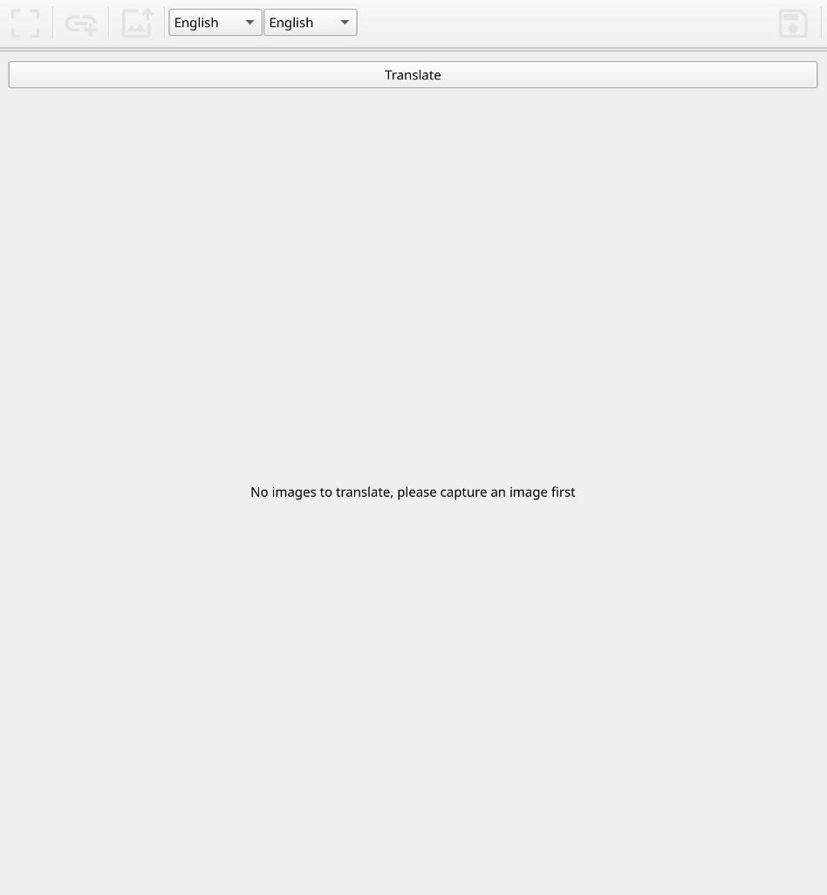
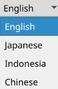
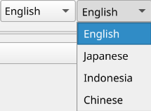
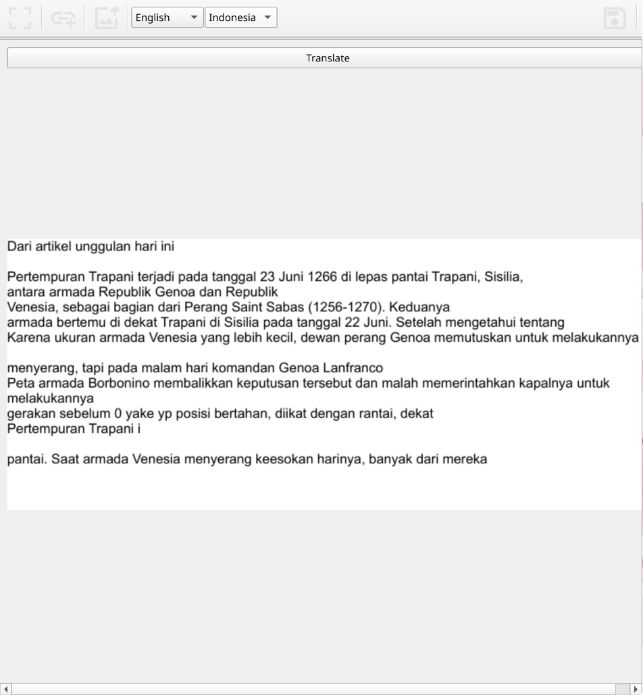
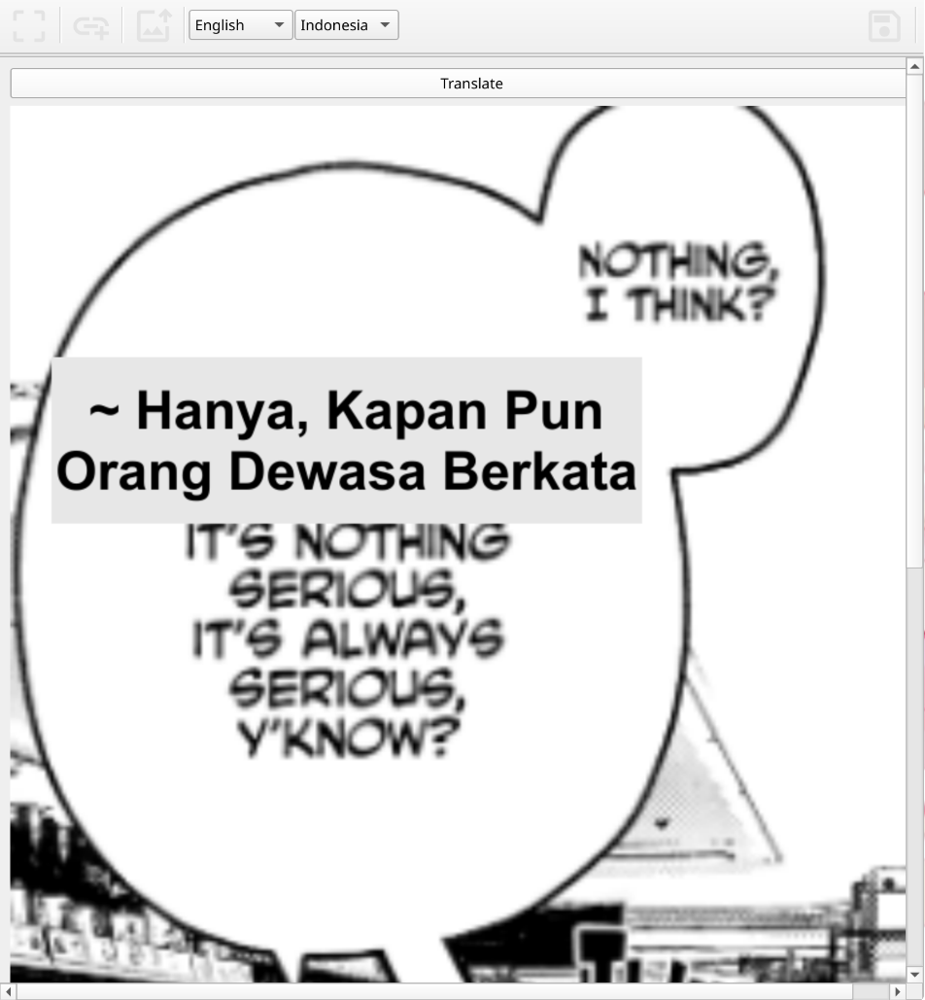
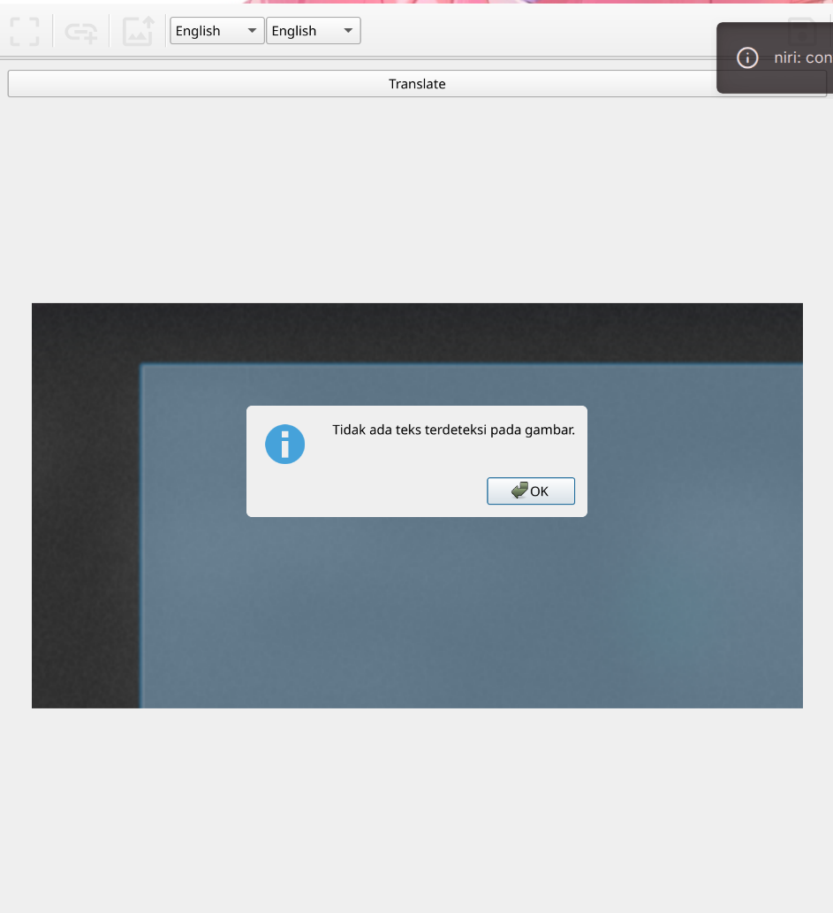
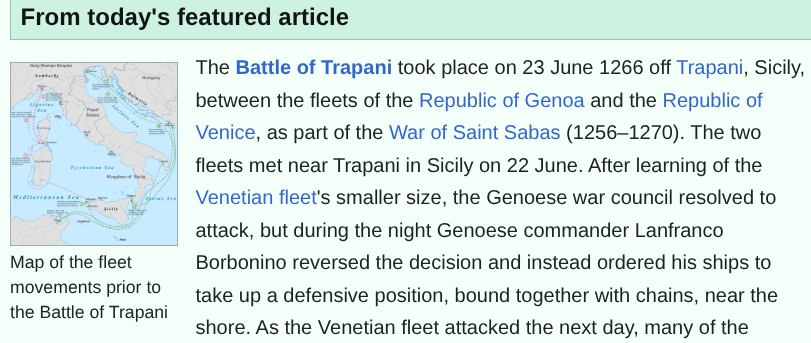
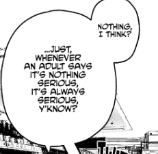
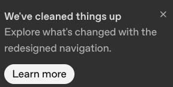

# ViSnap Image Translator

ViSnap is a desktop image translation tool built with Python and PySide6. It is designed for workflows where text is embedded inside screenshots, comic panels, scanned snippets, or images collected from the web.

The application can load an image from a screen capture, a local file, or an internet image URL, then run OCR and machine translation directly on the image. ViSnap renders the translated result back into the viewer so the output can be reviewed and saved.

## Features

- Capture a selected screen area and load it directly into the translator.
- Open images from local storage.
- Load images from an online image link.
- Detect text in images using Tesseract OCR.
- Translate detected text with Google Translator through `deep-translator`.
- Adapt the rendering mode automatically for dense text or comic-style speech bubbles.
- Save the translated image as PNG or JPG.
- Runs on Windows and Linux.

## Screenshots

### Main Interface



### Capture, Link, Upload, and Save Tools


### Source Language Selection



### Target Language Selection



### Text Translation Result



### Comic Bubble Translation



### No Text Detected State



## Example Images

The repository includes sample images that can be used to test upload, OCR, and translation behavior.







## Requirements

ViSnap requires Python and several OCR, GUI, and translation dependencies.

Python packages:

- `PySide6`
- `Pillow`
- `pytesseract`
- `deep-translator`

System dependency:

- Tesseract OCR

Linux screenshot support:

- X11/Xorg is recommended for the most reliable screen capture behavior.
- On Wayland, ViSnap can use `grim` as a fallback screenshot backend when available.

## Installation

### Linux

Install Tesseract OCR and, if using Wayland, install `grim`.

Arch Linux:

```bash
sudo pacman -S tesseract tesseract-data-eng grim
```

Ubuntu/Debian:

```bash
sudo apt install tesseract-ocr tesseract-ocr-eng grim
```

Activate the existing virtual environment with fish:

```fish
source venv/bin/activate.fish
```

If dependencies are not installed yet, install them with:

```fish
pip install PySide6 Pillow pytesseract deep-translator
```

Run the application:

```fish
python main.py
```

### Windows

Install Python and Tesseract OCR for Windows. After installing Tesseract, make sure the Tesseract executable is available from the system `PATH`.

Create and activate a virtual environment if needed:

```powershell
python -m venv venv
.\venv\Scripts\activate
```

Install the Python dependencies:

```powershell
pip install PySide6 Pillow pytesseract deep-translator
```

Run the application:

```powershell
python main.py
```

## Usage

1. Start ViSnap with `python main.py`.
2. Choose how to load an image:
   - Use **Capture** to select an area from the screen.
   - Use **Link** to load an image from an internet URL.
   - Use **Upload** to open an image from local storage.
3. Press **Translate** to run OCR and translation.
4. Review the translated image in the viewer.
5. Use **Save** to export the translated image as PNG or JPG.

## How Translation Works

ViSnap reads the visible image from the viewer and converts it into a format that can be processed by Tesseract OCR. The detected text is translated using `deep-translator`.

The application chooses a rendering strategy based on the amount of detected text:

- Dense text images are rendered as a full translated text block.
- Shorter comic-style images are translated per detected text region and drawn back into the image.

## Project Structure

```text
.
├── Assets/Icons/                 # Toolbar icons
├── Func/
│   ├── Tool_Func.py              # Upload, link loading, and save actions
│   └── translate_image.py        # OCR and translation pipeline
├── Pages/
│   ├── MainPage.py               # Main application window
│   └── Widgets/
│       ├── Capture/              # Screenshot capture overlay
│       ├── ToolBar/              # Application toolbar
│       └── ImageViewer.py        # Image preview and translate button
├── tampilan_aplikasi/            # Application screenshots for documentation
├── tes_gambar/                   # Sample images for testing
└── main.py                       # Application entry point
```

## Linux Notes

Screen capture on Linux depends on the desktop session.

On X11/Xorg, Qt screen capture is usually available directly.

On Wayland, desktop environments may restrict screen capture for security reasons. ViSnap includes a fallback path for `grim`, but the behavior still depends on compositor permissions. If capture returns an empty image, use one of these options:

- Install `grim`.
- Run the desktop session using X11/Xorg.
- Use **Upload** or **Link** as an alternative input method.

## Development Notes

Use the project virtual environment when working on Linux:

```fish
source venv/bin/activate.fish
python main.py
```

To verify Python syntax across the project:

```bash
python -m compileall main.py Pages Func
```

## License

No license file is currently included in this repository.
